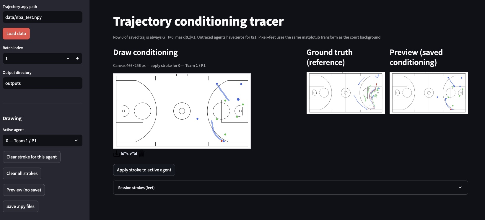

# gameplay-trajectory-canvas



Small **Streamlit** app for **hand-drawing players' trajectory instructions** on an NBA court. This app is intended for producing conditioning inputs for a downstream trajectory simulation model.

You load a batch of groundtruth trajectory scenes. For each scene, given the initial positions of players and ball, you can trace freehand path instructions for a subset of players. You can then export the conditioning data produces:
- resampled `(30, 11, 2)` path instructions (currently hard-coded timesteps of 30 based on a targeted NBA dataset)
- a step/agent **mask** 

## Requirements

- Python ≥ 3.11  
- [uv](https://docs.astral.sh/uv/) (recommended) or any env with deps from `pyproject.toml`

## Run

```bash
uv sync
uv run streamlit run streamlit_app.py
```

## Use your own data

1. Save trajectories as a NumPy array **`[b, t, a, c]`**:
   - **`b`**: batch size  
   - **`t`**: time steps in the clip  
   - **`a`**: must be **11** (agents 0–4 home, 5–9 away, 10 ball)  
   - **`c`**: at least **2** — **x, y in court feet** (same space as the matplotlib court; extra channels are ignored for drawing)

2. In the sidebar, set **Trajectory .npy path** to your file and click **Load data**.

3. Pick **Batch index**, choose an **Active agent**, draw on the court, **Apply stroke**, repeat for other agents as needed.

4. **Preview** or **Save .npy files** — writes `traj.npy` and `mask.npy` under the chosen output directory. Row `t=0` is always ground truth with mask 1; traced agents get 30 arc-length-resampled steps with mask 1; untraced agents stay zero for `t≥1` with mask 0 there.

The repo ships an example path `data/nba_test.npy` in the UI default; add that file (or your own) under `data/` if you want the default to work out of the box.
